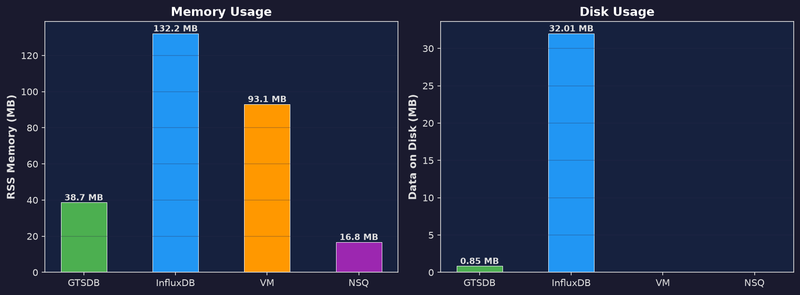
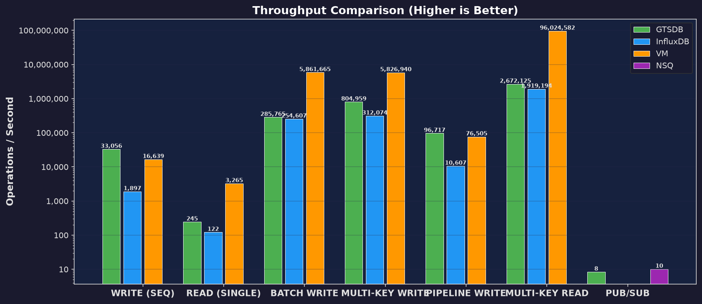
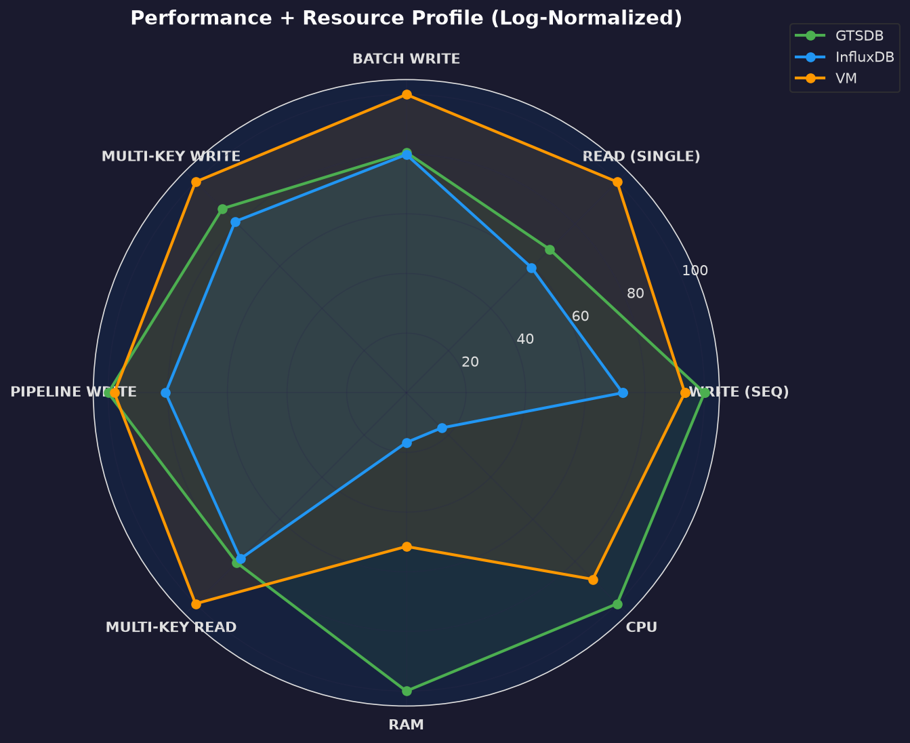
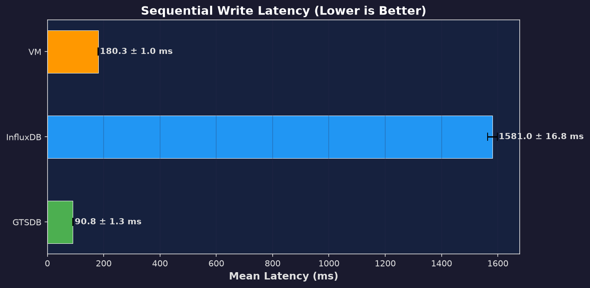
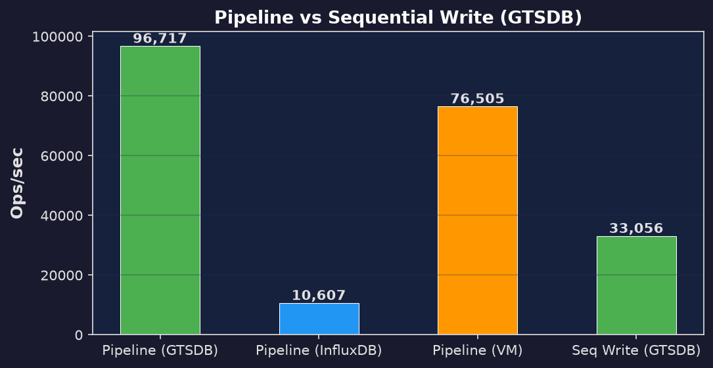
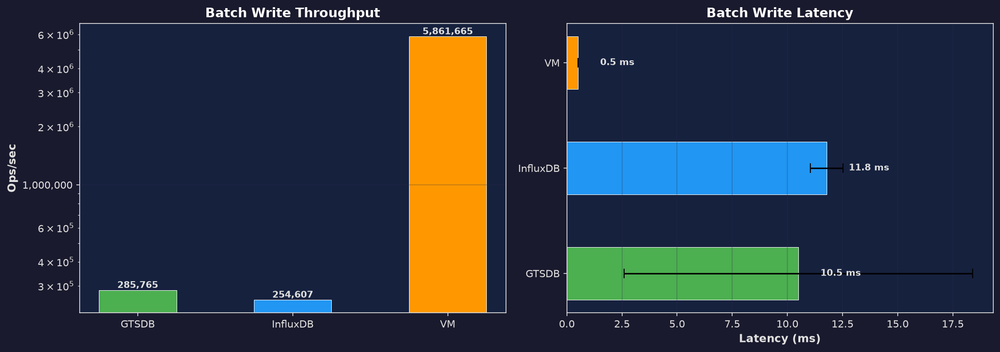
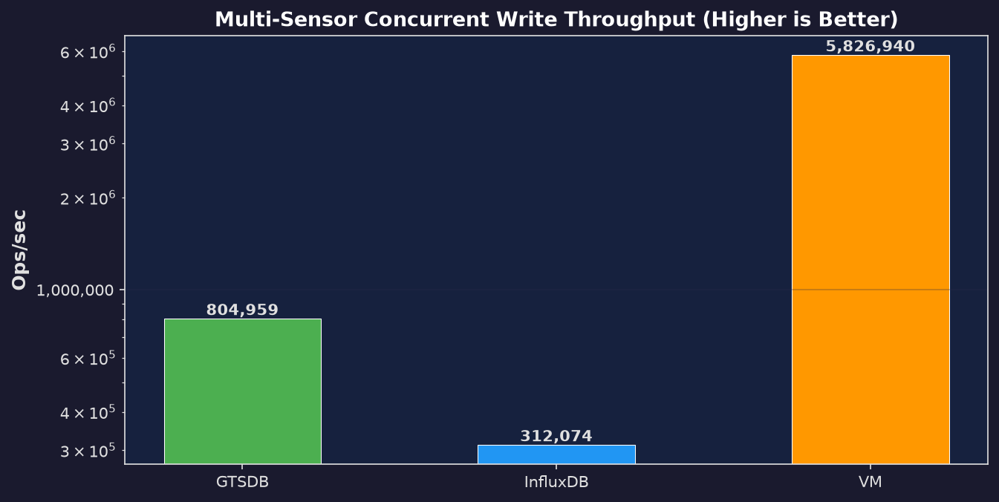
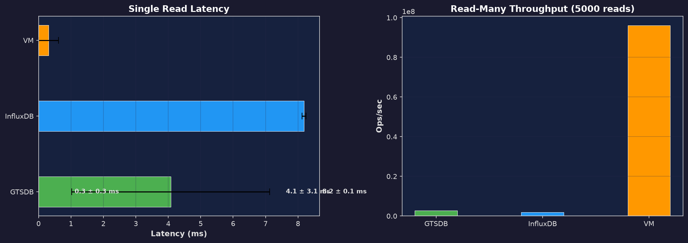
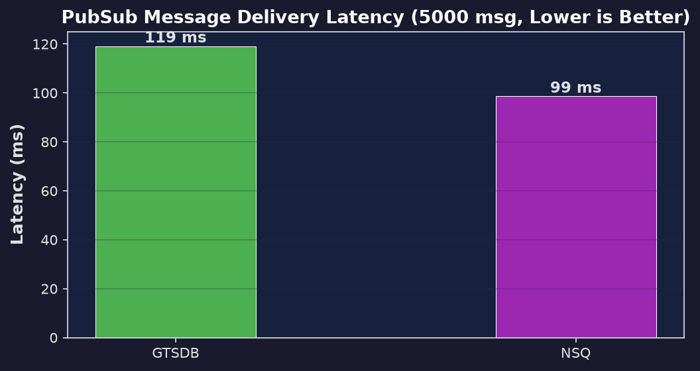

# Time Series Database Benchmark Report

**Generated:** 2026-07-13 02:48:07

## Overview

This report compares performance of the following time-series databases:

| Database | Version | Description |
|----------|---------|-------------|
| **GTSDB** | v1.0 | Custom Go time-series database (Hamster) |
| **InfluxDB** | v2.9.1 | Purpose-built time-series database |
| **VictoriaMetrics** | v1.147.0 | High-performance TSDB (Prometheus-compatible) |
| **NSQ** | v1.3.0 | Distributed messaging platform (pub/sub only) |

### Benchmark Configuration

| Parameter | Value |
|-----------|-------|
| Points per write | 5,000 |
| Sensors (multi-write) | 5 |
| Runs per benchmark | 3 |
| Warmup iterations | 300 |

### Resource Usage (Post-Benchmark)

## Overall Throughput Comparison

*Log scale. Higher bars indicate better throughput (ops/sec).*

## Performance Profile (Radar)

*Radar chart showing normalized performance across all benchmark types. 100 = best in class.*

## Write Benchmarks

### Sequential Single-Point Writes

| Driver | Mean | StdDev | Min | Max | P50 | P95 | P99 | Ops/sec |
|--------|------|--------|-----|-----|-----|-----|-----|---------|
| GTSDB | 90.75415 ms | 1.33775 ms | 89.4164 ms | 92.0919 ms | 89.4164 ms | 92.0919 ms | 92.0919 ms | 33,056.3 |
| InfluxDB | 1.58 s | 16.80435 ms | 1.56 s | 1.60 s | 1.56 s | 1.60 s | 1.60 s | 1,897.5 |
| VM | 180.2979 ms | 978 us | 179.3197 ms | 181.2761 ms | 179.3197 ms | 181.2761 ms | 181.2761 ms | 16,639.1 |

### Pipelined Writes (GTSDB)

| Driver | Mean | StdDev | Min | Max | P50 | P95 | P99 | Ops/sec |
|--------|------|--------|-----|-----|-----|-----|-----|---------|
| GTSDB | 31.01835 ms | 2.57525 ms | 28.4431 ms | 33.5936 ms | 28.4431 ms | 33.5936 ms | 33.5936 ms | 96,716.9 |
| InfluxDB | 282.83875 ms | 2.02125 ms | 280.8175 ms | 284.86 ms | 280.8175 ms | 284.86 ms | 284.86 ms | 10,606.8 |
| VM | 39.21335 ms | 737 us | 38.4761 ms | 39.9506 ms | 38.4761 ms | 39.9506 ms | 39.9506 ms | 76,504.6 |

### Batch/Bulk Writes

| Driver | Mean | StdDev | Min | Max | P50 | P95 | P99 | Ops/sec |
|--------|------|--------|-----|-----|-----|-----|-----|---------|
| GTSDB | 10.49815 ms | 7.90675 ms | 2.5914 ms | 18.4049 ms | 2.5914 ms | 18.4049 ms | 18.4049 ms | 285,764.6 |
| InfluxDB | 11.78285 ms | 749 us | 11.0341 ms | 12.5316 ms | 11.0341 ms | 12.5316 ms | 12.5316 ms | 254,607.3 |
| VM | 512 us | 400 ns | 511 us | 512 us | 511 us | 512 us | 512 us | 5,861,664.7 |

### Multi-Sensor Concurrent Writes

| Driver | Mean | StdDev | Min | Max | P50 | P95 | P99 | Ops/sec |
|--------|------|--------|-----|-----|-----|-----|-----|---------|
| GTSDB | 3.7269 ms | 1.6691 ms | 2.0578 ms | 5.396 ms | 2.0578 ms | 5.396 ms | 5.396 ms | 804,958.5 |
| InfluxDB | 9.6131 ms | 1.324 ms | 8.2891 ms | 10.9371 ms | 8.2891 ms | 10.9371 ms | 10.9371 ms | 312,074.1 |
| VM | 515 us | 2 us | 513 us | 517 us | 513 us | 517 us | 517 us | 5,826,939.9 |

## Read Benchmarks

### Single Read (Last 1 Point)

| Driver | Mean | StdDev | Min | Max | P50 | P95 | P99 | Ops/sec |
|--------|------|--------|-----|-----|-----|-----|-----|---------|
| GTSDB | 4.07595 ms | 3.05205 ms | 1.0239 ms | 7.128 ms | 1.0239 ms | 7.128 ms | 7.128 ms | 245.3 |
| InfluxDB | 8.187 ms | 64 us | 8.1225 ms | 8.2515 ms | 8.1225 ms | 8.2515 ms | 8.2515 ms | 122.1 |
| VM | 306 us | 306 us | 0 s | 612 us | 0 s | 612 us | 612 us | 3,265.3 |

### Read-Many (5000 Reads)

| Driver | Mean | StdDev | Min | Max | P50 | P95 | P99 | Ops/sec |
|--------|------|--------|-----|-----|-----|-----|-----|---------|
| GTSDB | 9.35585 ms | 2.06505 ms | 7.2908 ms | 11.4209 ms | 7.2908 ms | 11.4209 ms | 11.4209 ms | 2,672,124.9 |
| InfluxDB | 13.0263 ms | 249 us | 12.7773 ms | 13.2753 ms | 12.7773 ms | 13.2753 ms | 13.2753 ms | 1,919,194.2 |
| VM | 260 us | 260 us | 0 s | 521 us | 0 s | 521 us | 521 us | 96,024,582.3 |

## Pub/Sub Benchmark

| Driver | Mean | StdDev | Min | Max | P50 | P95 | P99 | Ops/sec |
|--------|------|--------|-----|-----|-----|-----|-----|---------|
| GTSDB | 119.1475 ms | 2.1041 ms | 117.0434 ms | 121.2516 ms | 117.0434 ms | 121.2516 ms | 121.2516 ms | 8.4 |
| NSQ | 98.61645 ms | 1.20225 ms | 97.4142 ms | 99.8187 ms | 97.4142 ms | 99.8187 ms | 99.8187 ms | 10.1 |

## Key Findings

### Sequential Write Throughput

- #1 **GTSDB**: **33,056 ops/sec** (90.75415 ms)
- #2 **VM**: **16,639 ops/sec** (180.2979 ms)
- #3 **InfluxDB**: **1,897 ops/sec** (1.58 s)

### Batch Write Throughput

- #1 **VM**: **5,861,665 ops/sec** (512 us)
- #2 **GTSDB**: **285,765 ops/sec** (10.49815 ms)
- #3 **InfluxDB**: **254,607 ops/sec** (11.78285 ms)

### Multi-Sensor Write Throughput

- #1 **VM**: **5,826,940 ops/sec** (515 us)
- #2 **GTSDB**: **804,959 ops/sec** (3.7269 ms)
- #3 **InfluxDB**: **312,074 ops/sec** (9.6131 ms)

### Read Performance

- #1 **VM**: **3,265 ops/sec** (306 us)
- #2 **GTSDB**: **245 ops/sec** (4.07595 ms)
- #3 **InfluxDB**: **122 ops/sec** (8.187 ms)

### Pub/Sub Latency

- #1 **NSQ**: **98.61645 ms** delivery latency
- #2 **GTSDB**: **119.1475 ms** delivery latency

## Head-to-Head Comparison

| Benchmark | Comparison | Ratio | Winner |
|-----------|------------|-------|--------|
| Write (seq) | GTSDB vs InfluxDB | 17.42x | **GTSDB** |
| Write (seq) | GTSDB vs VM | 1.99x | **GTSDB** |
| Pipeline Write | GTSDB vs InfluxDB | 9.12x | **GTSDB** |
| Pipeline Write | GTSDB vs VM | 1.26x | **GTSDB** |
| Batch Write | GTSDB vs InfluxDB | 1.12x | **GTSDB** |
| Batch Write | GTSDB vs VM | 20.51x | **VM** |
| Read (single) | GTSDB vs InfluxDB | 2.01x | **GTSDB** |
| Read (single) | GTSDB vs VM | 13.31x | **VM** |
| Multi-Key Write | GTSDB vs InfluxDB | 2.58x | **GTSDB** |
| Multi-Key Write | GTSDB vs VM | 7.24x | **VM** |
| Pub/Sub | GTSDB vs NSQ | 0.83x latency | **NSQ** |
| Multi-Key Read | GTSDB vs InfluxDB | 1.39x | **GTSDB** |
| Multi-Key Read | GTSDB vs VM | 35.94x | **VM** |
| Write (seq) | InfluxDB vs VM | 8.77x | **VM** |
| Pipeline Write | InfluxDB vs VM | 7.21x | **VM** |
| Batch Write | InfluxDB vs VM | 23.02x | **VM** |
| Read (single) | InfluxDB vs VM | 26.73x | **VM** |
| Multi-Key Write | InfluxDB vs VM | 18.67x | **VM** |
| Multi-Key Read | InfluxDB vs VM | 50.03x | **VM** |